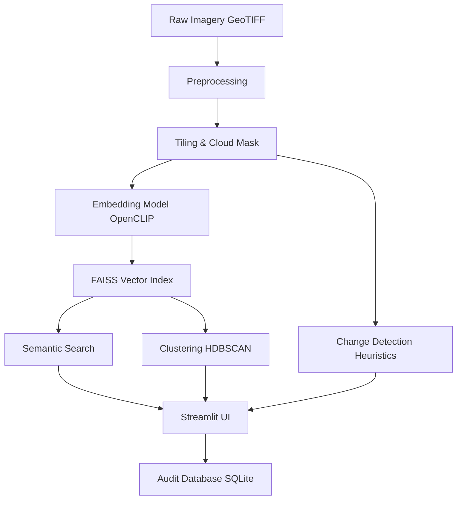

# Interstellar — Satellite Imagery Intelligence

A fully offline system that lets analysts search satellite imagery **by meaning** (e.g. "newly built structures near a river") and automatically flags **meaningful change over time**, filtering out false alarms like clouds and shadows.

## Features

- **Semantic Search**: Text-to-image and image-to-image search powered by CLIP embeddings and FAISS vector index.
- **Change Detection**: Rule-based temporal change classification (construction, vegetation clearance, water extent shifts, new roads).
- **Analyst Workflow**: Review queue with before/after evidence, confidence scoring, and an immutable audit trail.
- **Clustering / Discovery**: "Find Similar" functionality using embedding-space kNN and HDBSCAN.
- **Incremental Ingestion**: Add new imagery to the index without a full rebuild.
- **Fully Offline**: Designed to run on-premises in airgapped environments.

## Getting Started

### 1. Prerequisites

You need Docker and Docker Compose installed. 

### 2. Run the System

```bash
# Start the API and UI services
docker-compose up --build -d
```

- **UI**: http://localhost:8501
- **API Docs**: http://localhost:8000/docs

### 3. Generate Demo Data

Since downloading real Sentinel-2 data requires credentials, you can generate synthetic test data to verify the pipeline:

```bash
# Run inside the api container or locally
python scripts/generate_demo_data.py

# Build the initial index from the demo data
python scripts/build_index.py
```

## System Architecture

# Architecture Note: Interstellar

## Overview

Interstellar is designed as a modular, offline-first system for semantic satellite imagery search and change detection.

## Pipeline



## Core Components

1.  **Preprocessing (`app/services/preprocessing.py`)**: Uses Rasterio (or numpy fallback) to read multi-band GeoTIFFs, apply SCL cloud masks, and slice into 256x256 tiles.
2.  **Embeddings (`app/services/embedding.py`)**: Uses OpenCLIP (ViT-B-32 fallback for MVP) to map tiles and text queries into a 512-dimensional joint semantic space.
3.  **Vector Index (`app/services/vector_store.py`)**: Uses FAISS (`IndexFlatIP`) for fast cosine similarity search. Supports incremental `add_embeddings` without full rebuilds.
4.  **Change Detection (`app/services/change_detection.py`)**: Temporal pairs are analyzed using NDVI/NDWI shifts, band differencing, and edge density to classify changes (construction, clearance, etc.) while suppressing cloud false alarms.
5.  **FastAPI Backend (`app/main.py`)**: Exposes REST endpoints for search, ingestion, and review operations.
6.  **Streamlit Frontend (`ui/app.py`)**: A 4-tab interactive dashboard for analysts.
7.  **Database (`app/database.py`)**: SQLite (easily migratable to Postgres) tracks tile metadata, change candidates, and analyst review decisions.
## Evaluation

See `docs/evaluation_report.md` for the performance metrics.
