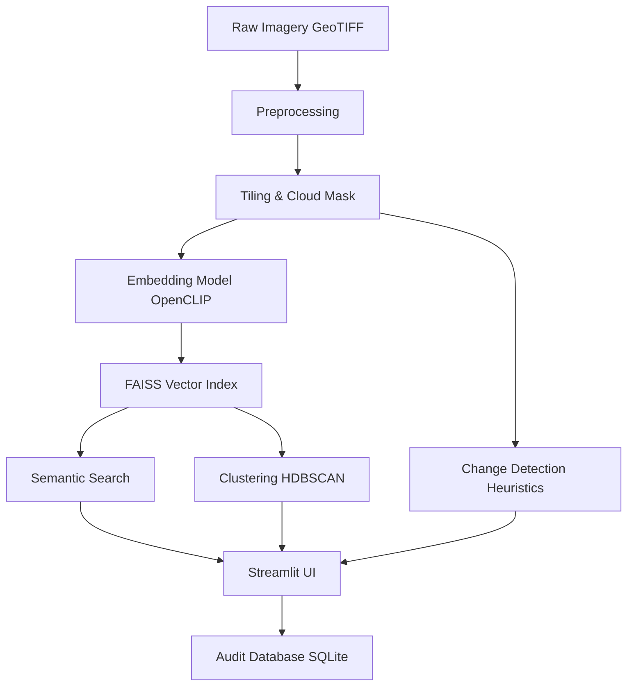

# Architecture Note: Interstellar

## Overview

Interstellar is designed as a modular, offline-first system for semantic satellite imagery search and change detection.

## Pipeline

## Core Components

1.  **Preprocessing (`app/services/preprocessing.py`)**: Uses Rasterio (or numpy fallback) to read multi-band GeoTIFFs, apply SCL cloud masks, and slice into 256x256 tiles.
2.  **Embeddings (`app/services/embedding.py`)**: Uses OpenCLIP (ViT-B-32 fallback for MVP) to map tiles and text queries into a 512-dimensional joint semantic space.
3.  **Vector Index (`app/services/vector_store.py`)**: Uses FAISS (`IndexFlatIP`) for fast cosine similarity search. Supports incremental `add_embeddings` without full rebuilds.
4.  **Change Detection (`app/services/change_detection.py`)**: Temporal pairs are analyzed using NDVI/NDWI shifts, band differencing, and edge density to classify changes (construction, clearance, etc.) while suppressing cloud false alarms.
5.  **FastAPI Backend (`app/main.py`)**: Exposes REST endpoints for search, ingestion, and review operations.
6.  **Streamlit Frontend (`ui/app.py`)**: A 4-tab interactive dashboard for analysts.
7.  **Database (`app/database.py`)**: SQLite (easily migratable to Postgres) tracks tile metadata, change candidates, and analyst review decisions.
